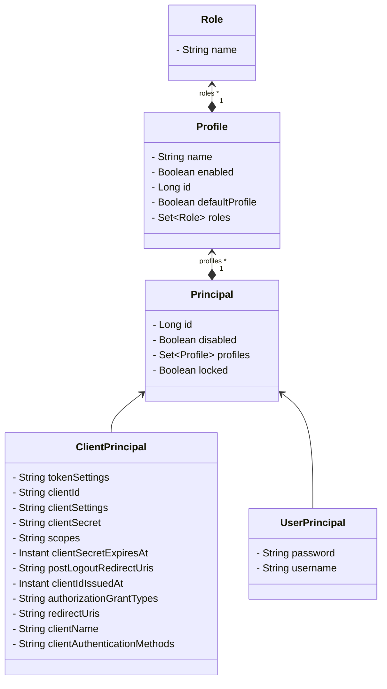

# Identity service
Part of IAM's core domain. Identity domain. Service that manages principals, users, roles, and permissions and their verification.

## Getting Started
These instructions will get you a copy of the project up and running on your local machine for development and testing purposes.

## Prerequisites
* [Maven](https://maven.apache.org/) is used as a build tool. Install it and set MAVEN_HOME to your system variables
* [Java 21](http://www.oracle.com) is present. Install it and set JAVA_HOME to your system variables
* [GIT](https://git-scm.com/) as a source distributed version control system
* [Docker](https://www.docker.com/)


### Build and Run Locally
#### checkout
Clone the project locally
```

```
#### build
```
mvn clean install
```
to skip the tests from the build use
```
mvn clean install -DskipTests
```
#### run
```
mvn spring-boot:run
```
### Model



### API
This project is build on spring data rest. The API is self documented and can be accessed at http://localhost:8081


## Resources
[](https://github.com/openleap-io/io.openleap.config/actions/workflows/main-build.yml)
[](LICENSE)
[](https://search.maven.org/search?q=a:io.openleap.config)
[](https://hub.docker.com/r/openleap/openleap-config)